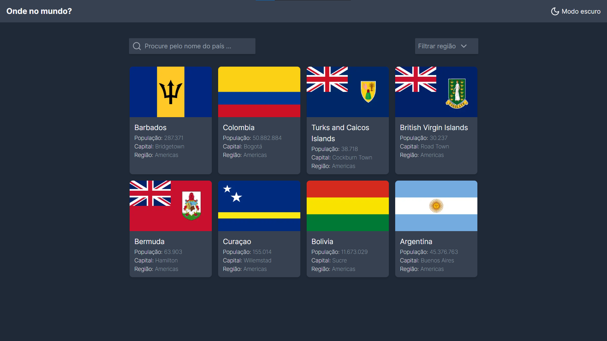
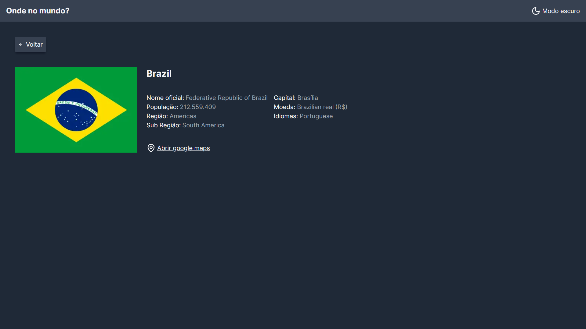

# Países do mundo

Esta aplicação é uma solução de um desafio proposto pelo site `frontend mentor` e funciona consumindo a api `rest countries` para listar todos os países do mundo e informações sobre eles

## Navegue entre os conteúdos

- [Deploy](#link-da-aplicação---link-deploy)
- [Screenshots](#screenshots)
- [Links](#links-🔗)

## Funcionalidades

- Temas claro e escuro
- Pesquisa por nome do país
- Filtro por continente
- Responsividade

## Link da aplicação - https://paises-do-mundo.vercel.app/

## Rodando localmente

Clone o projeto

```bash
  git clone git@github.com:Ronalt4cs/lista-de-paises.git
```

Entre no diretório do projeto

```bash
  cd my-project
```

Instale as dependências

```bash
  npm install
```

Inicie o servidor

```bash
  npm run start
```

## Screenshots





**Principais Tecnologias utilizadas**:
`NextJs` , `Axios`, `React`, `TypeScript`, `JavaScript`, `Tailwindcss`

## Links 🔗: 

* Linkedin - https://www.linkedin.com/in/ronalt-augusto-66202b24b/

* Frontend Mentor - https://www.frontendmentor.io/profile/Ronalt4cs

* Link da api - https://restcountries.com/
